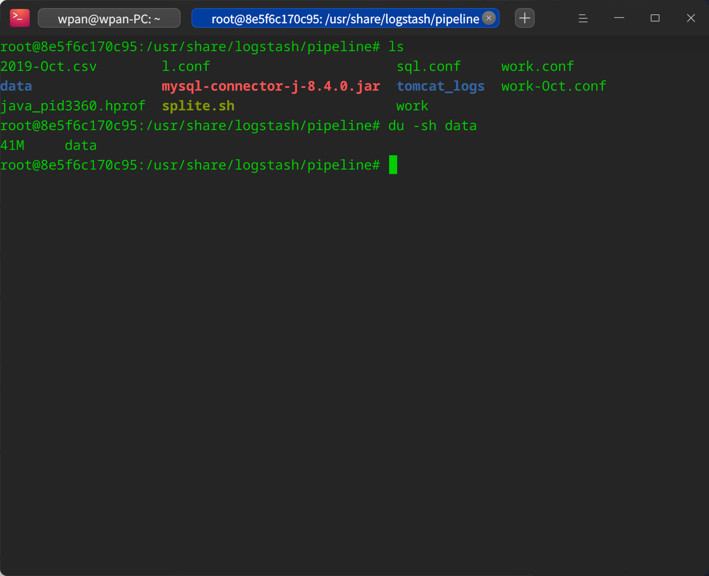
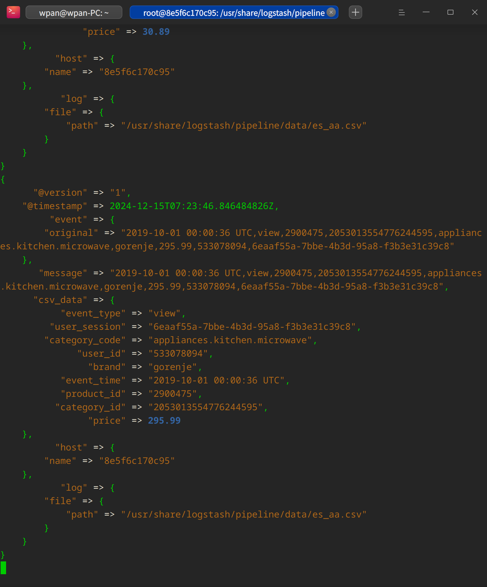
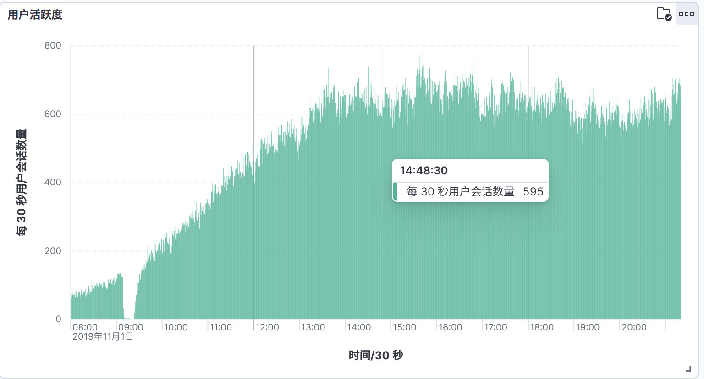
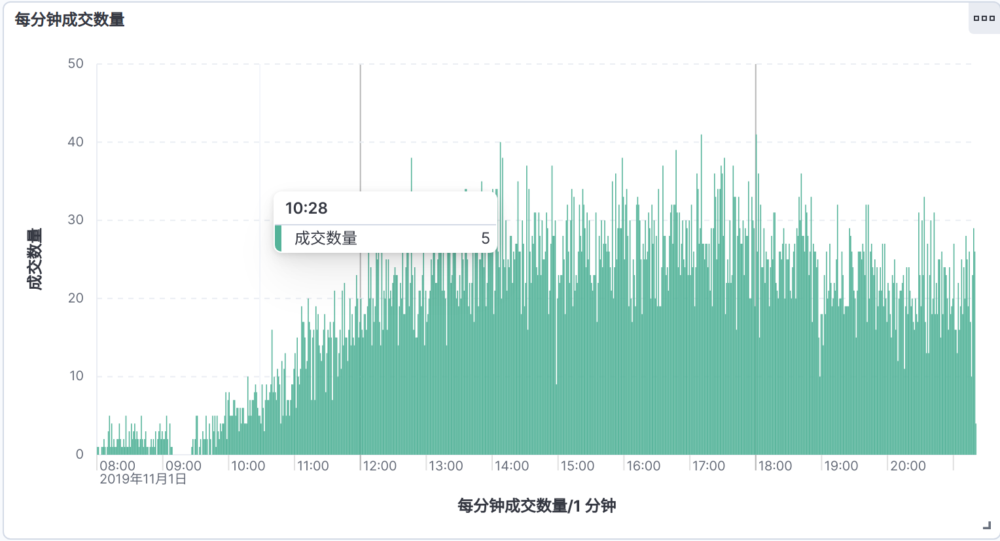
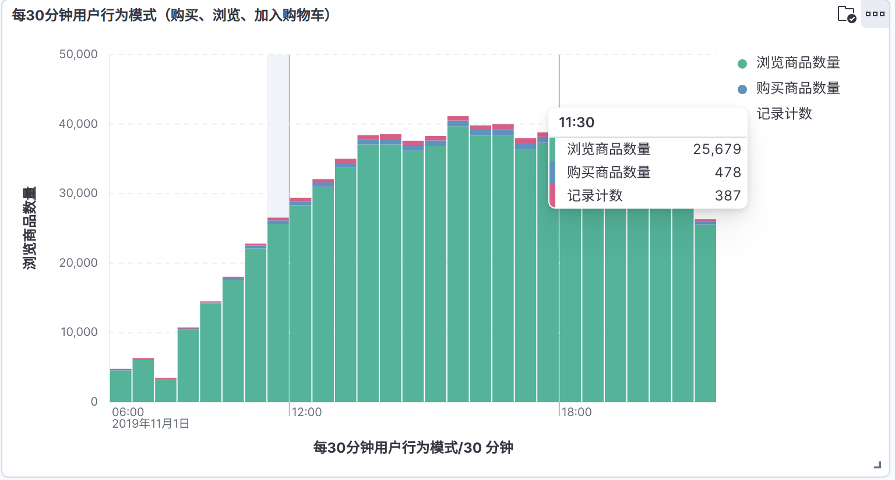
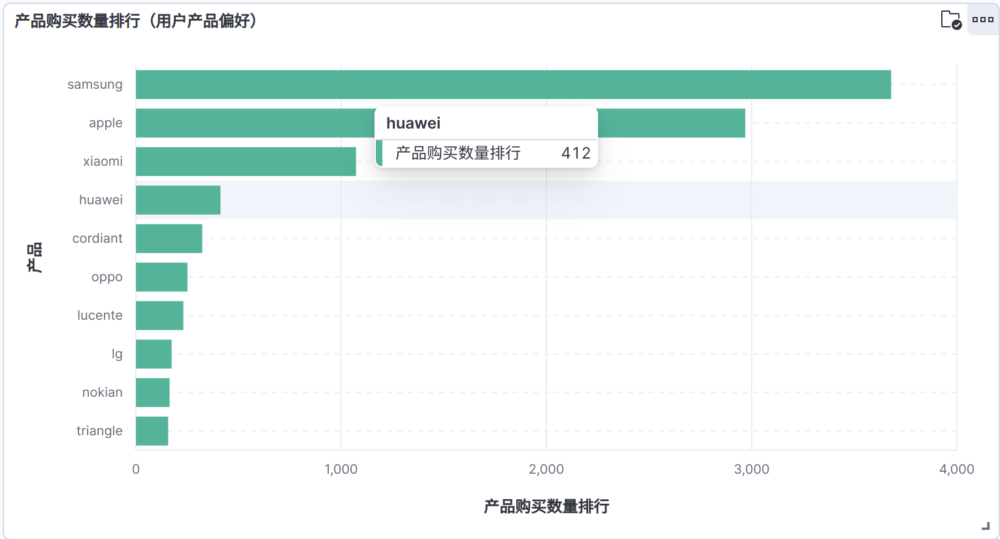
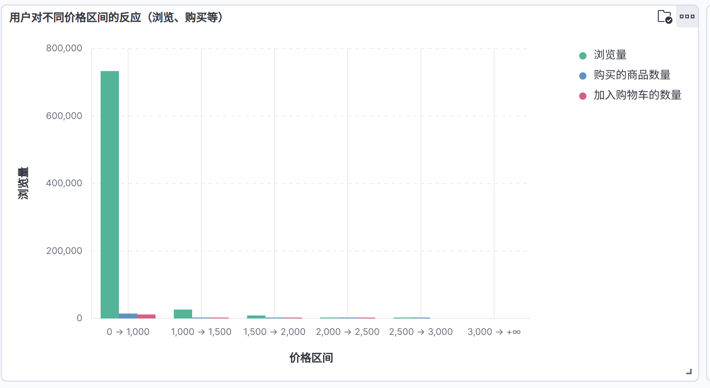
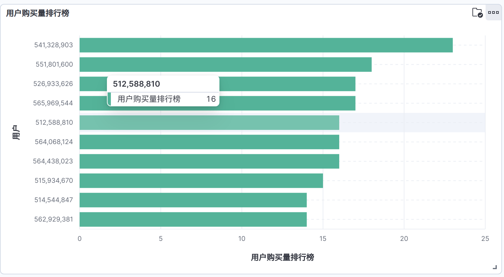
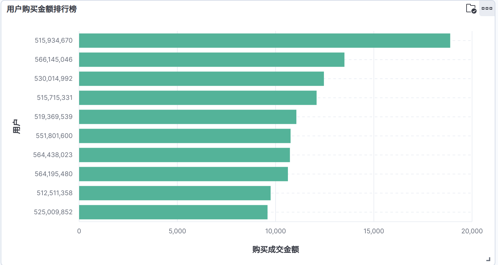
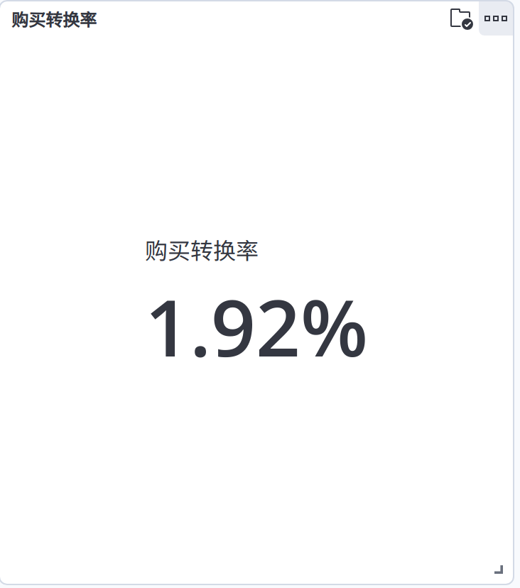

> **高级数据库技术与应用期末综合考察**
>
> 电子商务网站用户行为分析系统

# 环境准备

部署与 Debian12 2H2G 云服务器。

## Docker-compose

```yml
# 新版 docker-compose 不需要指定版本
# version: '3.9'

# Elasticsearch 和 kibana 统一使用 8.15.3 版本

services:
  elastic-search:
    image: docker.elastic.co/elasticsearch/elasticsearch:8.15.3
    container_name: 'elastic-search'
    restart: unless-stopped
    environment:
      - ELASTIC_PASSWORD=elastic
      - "ES_JAVA_OPTS=-Xms5G -Xmx5G"
      - discovery.type=single-node
      # - bootstrap.mlockall=true
      - bootstrap.memory_lock true
      # - http.enabled = true
      - xpack.security.enabled=false
      - xpack.security.http.ssl.enabled=false
      - xpack.security.transport.ssl.enabled=false
      - xpack.license.self_generated.type=basic
    ulimits:
      memlock:
        soft: -1
        hard: -1
    volumes:
      - elasticsearch-data:/usr/share/elasticsearch/data
      - elasticsearch-plugins:/usr/share/elasticsearch/plugins
    ports:
      - "9200:9200"
      - "9300:9300"
    networks:
      - elastic
    healthcheck:
      test: ["CMD-SHELL", "curl -s http://localhost:9200 | grep -q 'You Know, for Search'" ]
      interval: 1m30s
      timeout: 30s
      retries: 120
      start_period: 30s

  kibana:
    image: docker.elastic.co/kibana/kibana:8.15.3
    container_name: 'kibana'
    restart: unless-stopped
    depends_on:
      - elastic-search
      # elastic-search:
        # condition: service_healthy
    environment:
      - SERVERNAME = kibana
      - ELASTICSEARCH_HOSTS=http://elastic-search:9200
      - ELASTICSEARCH_USERNAME=kibana
      - ELASTICSEARCH_PASSWORD=kibana
      - I18N_LOCALE=zh-CN
    volumes:
      - kibana:/usr/share/kibana/data
    ports:
      - "5601:5601"
    networks:
      - elastic
    healthcheck:
      test: ["CMD-SHELL", "curl -s -I http://localhost:5601 | grep -q 'HTTP/1.1 302 Found'"]
      interval: 1m30s
      timeout: 30s
      retries: 120
      start_period: 30s
  
  logstash:
    image: docker.elastic.co/logstash/logstash:8.15.3
    container_name: 'logstash'
    restart: unless-stopped
    entrypoint: "top -b"
    depends_on:
      - elastic-search
    networks:
      elastic:
    ports:
      - "5044:5044"
      - "9600:9600"
    environment:
      - TZ=Asia/Shanghai
      - XPACK_MONITORING_ELASTICSEARCH_HOSTS=http://elastic-search:9200
    volumes:
      - "/etc/localtime:/etc/localtime"
      - "/etc/timezone:/etc/timezone"
      - "./pipeline:/usr/share/logstash/pipeline/"

networks:
  elastic:
  
volumes:
  kibana:
  logstash-pipeline:
  elasticsearch-data:
  elasticsearch-plugins:
```

**说明：**

`logstash` 打算在部署后进行配置，因此修改 `entrypoint`，后进入容器内部进行配置（主要目的是便于测试）。

# 数据收集

## 1、准备数据集

在 `kaggle` 中搜索电商相关数据，从[链接](https://www.kaggle.com/datasets/mkechinov/ecommerce-behavior-data-from-multi-category-store)中获取（需要代理）。

**备注：** 数据集过大，取 `2019-Nov.csv` 中前 40MB 的内容（共计 31 万条数据）



> 文件前十行内容：

```csv
event_time,event_type,product_id,category_id,category_code,brand,price,user_id,user_session
2019-10-01 00:00:00 UTC,view,44600062,2103807459595387724,,shiseido,35.79,541312140,72d76fde-8bb3-4e00-8c23-a032dfed738c
2019-10-01 00:00:00 UTC,view,3900821,2053013552326770905,appliances.environment.water_heater,aqua,33.20,554748717,9333dfbd-b87a-4708-9857-6336556b0fcc
2019-10-01 00:00:01 UTC,view,17200506,2053013559792632471,furniture.living_room.sofa,,543.10,519107250,566511c2-e2e3-422b-b695-cf8e6e792ca8
2019-10-01 00:00:01 UTC,view,1307067,2053013558920217191,computers.notebook,lenovo,251.74,550050854,7c90fc70-0e80-4590-96f3-13c02c18c713
2019-10-01 00:00:04 UTC,view,1004237,2053013555631882655,electronics.smartphone,apple,1081.98,535871217,c6bd7419-2748-4c56-95b4-8cec9ff8b80d
2019-10-01 00:00:05 UTC,view,1480613,2053013561092866779,computers.desktop,pulser,908.62,512742880,0d0d91c2-c9c2-4e81-90a5-86594dec0db9
2019-10-01 00:00:08 UTC,view,17300353,2053013553853497655,,creed,380.96,555447699,4fe811e9-91de-46da-90c3-bbd87ed3a65d
2019-10-01 00:00:08 UTC,view,31500053,2053013558031024687,,luminarc,41.16,550978835,6280d577-25c8-4147-99a7-abc6048498d6
2019-10-01 00:00:10 UTC,view,28719074,2053013565480109009,apparel.shoes.keds,baden,102.71,520571932,ac1cd4e5-a3ce-4224-a2d7-ff660a105880
```

字段说明：

1. `event_time`：事件发生的时间，格式为年-月-日 时:分:秒 UTC
2. `event_type`：事件类型，例如“view”表示浏览。
3. `product_id`：产品的唯一标识符
4. `category_id`：产品类别的唯一标识符
5. `category_code`：产品类别的编码，以点号分隔，表示从一级类别到三级类别的层级关系
6. `brand`：产品品牌
7. `price`：产品价格
8. `user_id`：用户的唯一标识符
9. `user_session`：用户会话的唯一标识符，用于追踪用户在一段时间内的行为

## 2、`Logstash` 导入配置文件

**Tips：** 需要按需修改

```conf
input {
  file {
    path => "/usr/share/logstash/pipeline/data/es_aa.csv"
    start_position => "beginning"
    sincedb_path => "/dev/null"
  }
}

filter {
  csv {
    # 指定字段分隔符
    separator => ","
    # 定义列名，按照CSV文件中的顺序
    columns => ["event_time", "event_type", "product_id", "category_id", "category_code", "brand", "price", "user_id", "user_session"]
    # 转换数据类型
    convert => {
      "price" => "float"
    }
    # 当ECS启用
    target => "csv_data"
    # 自动检测列名
    autodetect_column_names => true
    # 自动生成列名
    autogenerate_column_names => true
    # 跳过空列
    skip_empty_columns => true
    # 跳过空行
    skip_empty_rows => true
    # 跳过标题行
    skip_header => true
  }
  date {
    match => ["event_time", "yyyy-MM-dd HH:mm:ss Z"]
    target => "@timestamp"
  }
}

output {
  elasticsearch {
    hosts => ["http://elastic-search:9200"]
    index => "big_work"
  }
  stdout { codec => rubydebug }
}
```

## 3、将数据导入 elastic 中

```shell
# 需要绝对路径（logstash 不太聪明）
logstash -f $(pwd)/work.conf
```



## 4、在 kibana 中查看信息

**索引信息**

```json
GET /big_work
```

```json
{
  "big_work": {
    "aliases": {},
    "mappings": {
      "properties": {
        "@timestamp": {
          "type": "date"
        },
        "@version": {
          "type": "text",
          "fields": {
            "keyword": {
              "type": "keyword",
              "ignore_above": 256
            }
          }
        },
        "csv_data": {
          "properties": {
            "brand": {
              "type": "text",
              "fields": {
                "keyword": {
                  "type": "keyword",
                  "ignore_above": 256
                }
              }
            },
            "category_code": {
              "type": "text",
              "fields": {
                "keyword": {
                  "type": "keyword",
                  "ignore_above": 256
                }
              }
            },
            "category_id": {
              "type": "text",
              "fields": {
                "keyword": {
                  "type": "keyword",
                  "ignore_above": 256
                }
              }
            },
            "event_time": {
              "type": "text",
              "fields": {
                "keyword": {
                  "type": "keyword",
                  "ignore_above": 256
                }
              }
            },
            "event_type": {
              "type": "text",
              "fields": {
                "keyword": {
                  "type": "keyword",
                  "ignore_above": 256
                }
              }
            },
            "price": {
              "type": "float"
            },
            "product_id": {
              "type": "text",
              "fields": {
                "keyword": {
                  "type": "keyword",
                  "ignore_above": 256
                }
              }
            },
            "user_id": {
              "type": "text",
              "fields": {
                "keyword": {
                  "type": "keyword",
                  "ignore_above": 256
                }
              }
            },
            "user_session": {
              "type": "text",
              "fields": {
                "keyword": {
                  "type": "keyword",
                  "ignore_above": 256
                }
              }
            }
          }
        },
        "event": {
          "properties": {
            "original": {
              "type": "text",
              "fields": {
                "keyword": {
                  "type": "keyword",
                  "ignore_above": 256
                }
              }
            }
          }
        },
        "host": {
          "properties": {
            "name": {
              "type": "text",
              "fields": {
                "keyword": {
                  "type": "keyword",
                  "ignore_above": 256
                }
              }
            }
          }
        },
        "log": {
          "properties": {
            "file": {
              "properties": {
                "path": {
                  "type": "text",
                  "fields": {
                    "keyword": {
                      "type": "keyword",
                      "ignore_above": 256
                    }
                  }
                }
              }
            }
          }
        },
        "message": {
          "type": "text",
          "fields": {
            "keyword": {
              "type": "keyword",
              "ignore_above": 256
            }
          }
        }
      }
    },
    "settings": {
      "index": {
        "routing": {
          "allocation": {
            "include": {
              "_tier_preference": "data_content"
            }
          }
        },
        "number_of_shards": "1",
        "provided_name": "big_work",
        "creation_date": "1734183516513",
        "number_of_replicas": "1",
        "uuid": "GCfcOQvHRDutdJLDRTs7QQ",
        "version": {
          "created": "8512000"
        }
      }
    }
  }
}
```

**数据统计**

```json
GET /big_worl/_count
```

```json
{
  "count": 799999,
  "_shards": {
    "total": 1,
    "successful": 1,
    "skipped": 0,
    "failed": 0
  }
}
```

# 用户行为分析

## 定义

### 用户行为信息

1. **事件时间（event_time）**
2. **事件类型（event_type）**
3. **产品信息（product_id, brand, price）**：产品ID、品牌、价格

### 用户行为分析

1. 用户活跃度
2. 用户行为模式（浏览、购买等）
3. 用户产品偏好
4. 用户对不用价格区间的反应
5. 用户存留分析（user_id 和 user_session）查看用户在平台是否有多次购买
6. 跳出率分析，依据 user_session 和用户行为模式
7. 转化率分析，用户浏览商品后进行购买的比例

## 聚合查询

### 1. 用户活跃度

**查询：**

```json
GET big_work/_search
{
  "size": 0,
  "aggs": {
    "hourly_activity": {
      "date_histogram": {
        "field": "event_time",
        "calendar_interval": "hour"
      },
      "aggs": {
        "unique_users": {
          "cardinality": {
            "field": "user_id"
          }
        }
      }
    }
  }
}
```

**结果：**

```json
{
  "took": 341,
  "timed_out": false,
  "_shards": {
    "total": 1,
    "successful": 1,
    "skipped": 0,
    "failed": 0
  },
  "hits": {
    "total": {
      "value": 10000,
      "relation": "gte"
    },
    "max_score": null,
    "hits": []
  },
  "aggregations": {
    "hourly_activity": {
      "buckets": [
        {
          "key_as_string": "2019-11-01 00:00:00",
          "key": 1572566400000,
          "doc_count": 10887,
          "unique_users": {
            "value": 2314
          }
        },
        {
          "key_as_string": "2019-11-01 01:00:00",
          "key": 1572570000000,
          "doc_count": 14000,
          "unique_users": {
            "value": 3438
          }
        },
        {
          "key_as_string": "2019-11-01 02:00:00",
          "key": 1572573600000,
          "doc_count": 32498,
          "unique_users": {
            "value": 7196
          }
        },
        {
          "key_as_string": "2019-11-01 03:00:00",
          "key": 1572577200000,
          "doc_count": 49348,
          "unique_users": {
            "value": 11040
          }
        },
        {
          "key_as_string": "2019-11-01 04:00:00",
          "key": 1572580800000,
          "doc_count": 61480,
          "unique_users": {
            "value": 13429
          }
        },
        {
          "key_as_string": "2019-11-01 05:00:00",
          "key": 1572584400000,
          "doc_count": 73450,
          "unique_users": {
            "value": 16231
          }
        },
        {
          "key_as_string": "2019-11-01 06:00:00",
          "key": 1572588000000,
          "doc_count": 76155,
          "unique_users": {
            "value": 17035
          }
        },
        {
          "key_as_string": "2019-11-01 07:00:00",
          "key": 1572591600000,
          "doc_count": 79426,
          "unique_users": {
            "value": 17535
          }
        },
        {
          "key_as_string": "2019-11-01 08:00:00",
          "key": 1572595200000,
          "doc_count": 79818,
          "unique_users": {
            "value": 17635
          }
        },
        {
          "key_as_string": "2019-11-01 09:00:00",
          "key": 1572598800000,
          "doc_count": 76812,
          "unique_users": {
            "value": 17015
          }
        },
        {
          "key_as_string": "2019-11-01 10:00:00",
          "key": 1572602400000,
          "doc_count": 75667,
          "unique_users": {
            "value": 16996
          }
        },
        {
          "key_as_string": "2019-11-01 11:00:00",
          "key": 1572606000000,
          "doc_count": 71407,
          "unique_users": {
            "value": 15435
          }
        },
        {
          "key_as_string": "2019-11-01 12:00:00",
          "key": 1572609600000,
          "doc_count": 72744,
          "unique_users": {
            "value": 15909
          }
        },
        {
          "key_as_string": "2019-11-01 13:00:00",
          "key": 1572613200000,
          "doc_count": 26307,
          "unique_users": {
            "value": 6667
          }
        }
      ]
    }
  }
}
```

### 2. 用户行为模式（浏览、购买等）

**查询：**

```json
GET big_work/_search
{
  "size": 0,
  "aggs": {
    "behavior_distribution": {
      "terms": {
        "field": "event_type",
        "size": 10
      }
    }
  }
}
```

**结果：**

```json
{
  "took": 2,
  "timed_out": false,
  "_shards": {
    "total": 1,
    "successful": 1,
    "skipped": 0,
    "failed": 0
  },
  "hits": {
    "total": {
      "value": 10000,
      "relation": "gte"
    },
    "max_score": null,
    "hits": []
  },
  "aggregations": {
    "behavior_distribution": {
      "doc_count_error_upper_bound": 0,
      "sum_other_doc_count": 0,
      "buckets": [
        {
          "key": "view",
          "doc_count": 771933
        },
        {
          "key": "purchase",
          "doc_count": 15333
        },
        {
          "key": "cart",
          "doc_count": 12733
        }
      ]
    }
  }
}
```

### 3. 用户产品偏好

**查询：**

```json
GET big_work/_search
{
  "size": 0,
  "aggs": {
    "brand_preference": {
      "terms": {
        "field": "brand",
        "size": 10
      }
    }
  }
}
```

**结果：**

```json
{
  "took": 39,
  "timed_out": false,
  "_shards": {
    "total": 1,
    "successful": 1,
    "skipped": 0,
    "failed": 0
  },
  "hits": {
    "total": {
      "value": 10000,
      "relation": "gte"
    },
    "max_score": null,
    "hits": []
  },
  "aggregations": {
    "brand_preference": {
      "doc_count_error_upper_bound": 0,
      "sum_other_doc_count": 361937,
      "buckets": [
        {
          "key": "samsung",
          "doc_count": 101168
        },
        {
          "key": "apple",
          "doc_count": 80921
        },
        {
          "key": "xiaomi",
          "doc_count": 57733
        },
        {
          "key": "huawei",
          "doc_count": 18779
        },
        {
          "key": "lucente",
          "doc_count": 12441
        },
        {
          "key": "oppo",
          "doc_count": 10883
        },
        {
          "key": "lg",
          "doc_count": 10223
        },
        {
          "key": "cordiant",
          "doc_count": 9619
        },
        {
          "key": "bosch",
          "doc_count": 9517
        },
        {
          "key": "sony",
          "doc_count": 9146
        }
      ]
    }
  }
}
```

### 4. 用户对不用价格区间的反应

**查询：**

```json
GET big_work/_search
{
  "size": 0,
  "aggs": {
    "price_sensitivity": {
      "range": {
        "field": "price",
        "ranges": [
          { "to": 50 },
          { "from": 50, "to": 100 },
          { "from": 100, "to": 500 },
          { "from": 500 }
        ]
      }
    }
  }
}
```

**结果：**

```json
{
  "took": 28,
  "timed_out": false,
  "_shards": {
    "total": 1,
    "successful": 1,
    "skipped": 0,
    "failed": 0
  },
  "hits": {
    "total": {
      "value": 10000,
      "relation": "gte"
    },
    "max_score": null,
    "hits": []
  },
  "aggregations": {
    "price_sensitivity": {
      "buckets": [
        {
          "key": "*-50.0",
          "to": 50,
          "doc_count": 144668
        },
        {
          "key": "50.0-100.0",
          "from": 50,
          "to": 100,
          "doc_count": 122631
        },
        {
          "key": "100.0-500.0",
          "from": 100,
          "to": 500,
          "doc_count": 397696
        },
        {
          "key": "500.0-*",
          "from": 500,
          "doc_count": 135004
        }
      ]
    }
  }
}
```

### 5. 用户存留分析（user_id 和 user_session）查看用户在平台是否有多次购买

**查询：**

```json
GET big_work/_search
{
  "size": 0,
  "aggs": {
    "user_sessions": {
      "terms": {
        "field": "user_id",
        "min_doc_count": 2
      },
      "aggs": {
        "session_count": {
          "cardinality": {
            "field": "user_session"
          }
        }
      }
    }
  }
}
```

**结果：**

```json
{
  "took": 250,
  "timed_out": false,
  "_shards": {
    "total": 1,
    "successful": 1,
    "skipped": 0,
    "failed": 0
  },
  "hits": {
    "total": {
      "value": 10000,
      "relation": "gte"
    },
    "max_score": null,
    "hits": []
  },
  "aggregations": {
    "user_sessions": {
      "doc_count_error_upper_bound": 0,
      "sum_other_doc_count": 797364,
      "buckets": [
        {
          "key": 537972582,
          "doc_count": 504,
          "session_count": {
            "value": 1
          }
        },
        {
          "key": 539585530,
          "doc_count": 468,
          "session_count": {
            "value": 6
          }
        },
        {
          "key": 529413254,
          "doc_count": 294,
          "session_count": {
            "value": 14
          }
        },
        {
          "key": 559249905,
          "doc_count": 286,
          "session_count": {
            "value": 4
          }
        },
        {
          "key": 556444587,
          "doc_count": 197,
          "session_count": {
            "value": 2
          }
        },
        {
          "key": 563525937,
          "doc_count": 192,
          "session_count": {
            "value": 5
          }
        },
        {
          "key": 514127132,
          "doc_count": 187,
          "session_count": {
            "value": 4
          }
        },
        {
          "key": 515789329,
          "doc_count": 179,
          "session_count": {
            "value": 4
          }
        },
        {
          "key": 532599748,
          "doc_count": 167,
          "session_count": {
            "value": 2
          }
        },
        {
          "key": 512542757,
          "doc_count": 161,
          "session_count": {
            "value": 9
          }
        }
      ]
    }
  }
}
```

### 6. 跳出率分析，依据 user_session 和用户行为模式

**查询：**

```json
GET big_work/_search
{
  "size": 0,
  "aggs": {
    "user_sessions": {
      "terms": {
        "field": "user_session"
      },
      "aggs": {
        "action_count": {
          "value_count": {
            "field": "event_type"
          }
        },
        "is_bounce": {
          "bucket_script": {
            "buckets_path": {
              "action_count": "action_count"
            },
            "script": "if (params.action_count!= null) { return (params.action_count == 1)? 1 : 0; } else { return 0; }"
          }
        }
      }
    }
  }
}

```

**结果：**

```json
{
  "took": 151,
  "timed_out": false,
  "_shards": {
    "total": 1,
    "successful": 1,
    "skipped": 0,
    "failed": 0
  },
  "hits": {
    "total": {
      "value": 10000,
      "relation": "gte"
    },
    "max_score": null,
    "hits": []
  },
  "aggregations": {
    "user_sessions": {
      "doc_count_error_upper_bound": 0,
      "sum_other_doc_count": 798088,
      "buckets": [
        {
          "key": "4488e77a-9901-4c4b-b162-47a224ceab51",
          "doc_count": 504,
          "action_count": {
            "value": 504
          },
          "is_bounce": {
            "value": 0
          }
        },
        {
          "key": "e6d2aed7-d07f-48af-867a-8741e2b24f1b",
          "doc_count": 246,
          "action_count": {
            "value": 246
          },
          "is_bounce": {
            "value": 0
          }
        },
        {
          "key": "135867a0-6382-4c86-8a8c-821796673484",
          "doc_count": 191,
          "action_count": {
            "value": 191
          },
          "is_bounce": {
            "value": 0
          }
        },
        {
          "key": "bad2fbec-4fda-44c7-b654-0b7a2a887560",
          "doc_count": 155,
          "action_count": {
            "value": 155
          },
          "is_bounce": {
            "value": 0
          }
        },
        {
          "key": "2d5298e4-108d-4cdb-944f-df48b52e7fa9",
          "doc_count": 150,
          "action_count": {
            "value": 150
          },
          "is_bounce": {
            "value": 0
          }
        },
        {
          "key": "0c239db5-422b-4198-b76a-035ffcc275fa",
          "doc_count": 143,
          "action_count": {
            "value": 143
          },
          "is_bounce": {
            "value": 0
          }
        },
        {
          "key": "0e6417d3-428c-427b-9b92-b4c8e9b8c1c0",
          "doc_count": 134,
          "action_count": {
            "value": 134
          },
          "is_bounce": {
            "value": 0
          }
        },
        {
          "key": "e46bffd0-fe44-41fc-b0e5-e5578a621f88",
          "doc_count": 134,
          "action_count": {
            "value": 134
          },
          "is_bounce": {
            "value": 0
          }
        },
        {
          "key": "9bef6ff3-61bd-4e0a-9e12-4cc9e38517d7",
          "doc_count": 131,
          "action_count": {
            "value": 131
          },
          "is_bounce": {
            "value": 0
          }
        },
        {
          "key": "6907e882-d76f-4be4-87c8-bdbfc5ab5ae4",
          "doc_count": 123,
          "action_count": {
            "value": 123
          },
          "is_bounce": {
            "value": 0
          }
        }
      ]
    }
  }
}
```

### 7. 转化率分析，用户浏览商品后进行购买的比例

**查询：**

```json
GET big_work/_search
{
  "size": 0,
  "query": {
    "bool": {
      "must": [
        {
          "terms": {
            "event_type": [
              "view",
              "purchase"
            ]
          }
        }
      ]
    }
  },
  "aggs": {
    "views": {
      "filter": {
        "term": {
          "event_type": "view"
        }
      },
      "aggs": {
        "unique_viewing_users": {
          "cardinality": {
            "field": "user_id"
          }
        }
      }
    },
    "purchases": {
      "filter": {
        "term": {
          "event_type": "purchase"
        }
      },
      "aggs": {
        "unique_purchasing_users": {
          "cardinality": {
            "field": "user_id"
          }
        }
      }
    }
  }
}
```

**结果：**

```json
{
  "took": 140,
  "timed_out": false,
  "_shards": {
    "total": 1,
    "successful": 1,
    "skipped": 0,
    "failed": 0
  },
  "hits": {
    "total": {
      "value": 10000,
      "relation": "gte"
    },
    "max_score": null,
    "hits": []
  },
  "aggregations": {
    "purchases": {
      "doc_count": 15333,
      "unique_purchasing_users": {
        "value": 11471
      }
    },
    "views": {
      "doc_count": 771933,
      "unique_viewing_users": {
        "value": 140167
      }
    }
  }
}
```

# 数据可视化

1. 每30s的用户活跃度



2. 每分钟成交数量



3. 每30分钟用户行为模式（购买、浏览、加入购物车）



4. 产品购买数量排行（用户产品偏好）



5. 用户对不同价格区间的反应（浏览、购买等）



6. 用户购买量排行榜



7. 用户购买金额排行榜



8. 购买转换率



# 结果分析

**用户：**

总体来看，这个商城中每秒都有大量用户访问，每分钟成交量在 [20, 30] 个之间。若是忽略浏览量，有些商品会出现购买量大于加入购物车的数量。

**商品：**

购买排行榜中，前三分别是三星、苹果和小米，除此之外进入前十的榜单也存在多个国产产品，例如：华为、oppo

**转换率：**

在 80 万浏览（购买）记录中，转换率高达 1.92%，换算之后大约 15,360 成交量。考虑购买价格区间在 0 ~ 1000 之间，在 2019年11月这天成交金额高达 7,680,000（15360 * 500）美元！

# 问题记录

## 1. 试图在 input 中使用 *.csv 批量导入数据

导致：数据会被第二个文件覆盖

## 2. date 没有正确转换

源文件中时间字段后面多了 `UTC` 字样，删除后重新导入。

```shell
sed 's/ UTC//g' origin.csv new.csv
```

# 附录

## 1. 文件截取工具（取自网络）

```shell
#!/bin/bash
source /etc/profile
export JAVA_HOME=/usr/share/logstash/jdk/
size=$1
file=$2

FileSize=`ls -l $file |awk '{print $5}'`
res=`echo "scale=2;$FileSize/(1024*1024*$size)+0.1" |bc` #根据要求的大小，算需要分割为多少个文件
lines=`wc -l $file |awk '{print $1}'`
echo orginal file lines is $lines, split file less than $1M, file number '>' $res
num=`echo "$lines/$res" |bc`
# 判断目录是否存在
if [[ $3 == */* ]]
then
   #获得目录  dist_10040503_res/tianmao_ 截取dist_10040503_res/为目录
   # -v awk_all="$3" 是shell给awk传参数的做法 此处的$3是shell的外部参数
   dic=`awk -v awk_all="$3" 'BEGIN{info=awk_all;tlen=split(info,tA,"/");dic=length(info)-length(tA[tlen]);{print substr(info,1,dic)}}'`
   if [[ ! -d "$dic" ]]
   then
      mkdir -p $dic
   fi
fi
splitFile=`split -l $num $file $3`
# 修改后缀
for i in $3*
do
   fileName="$i"".csv"
   echo $fileName
   mv $i $i".csv"
done
```

用法： `脚本 分割后文件大小 原数据 地址及前缀`