> **学院：省级示范性软件学院**
>
> **题目：** 《 实验五：Kibana 操作》
>
> **姓名：潘文宝**
>
> **学号：** 2200770201
>
> **班级：** 软工2203
>
> **日期：** 2024-11-8
>
> **实验环境：**  Debian12 + Docker + Elasticsearch-8.15.3 + ELK

# 一、实验目的

掌握 Kibana 可视化操作

# 二、实验内容

可视化总览

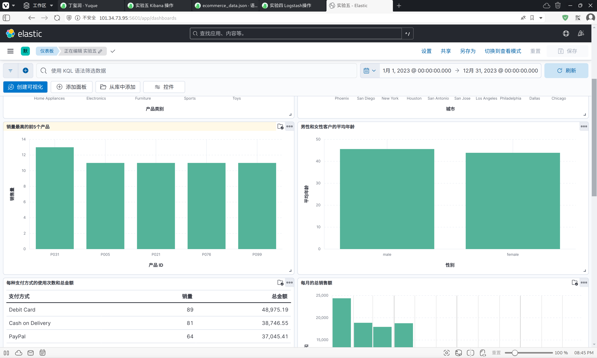

1. 统计每个产品类别的总销售额。

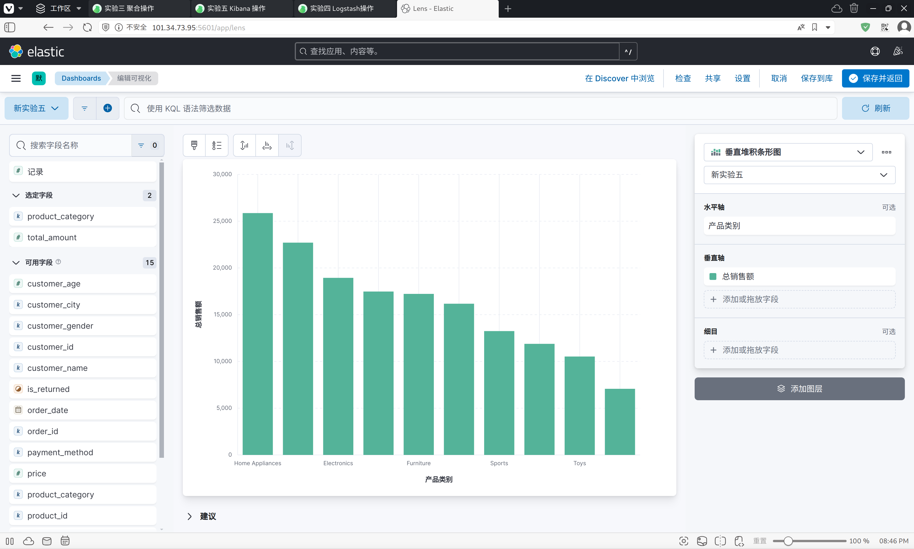

1. 计算每个城市的平均订单金额。

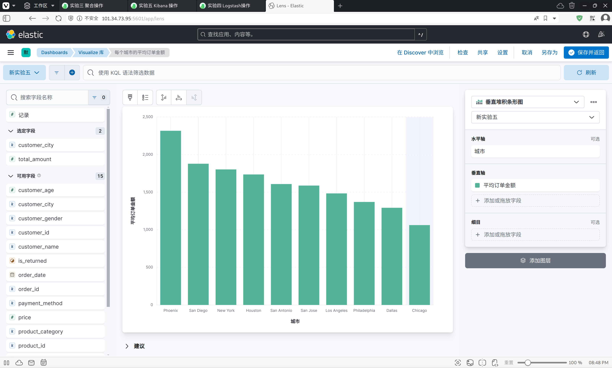

3. 找出销量最高的前5个产品。

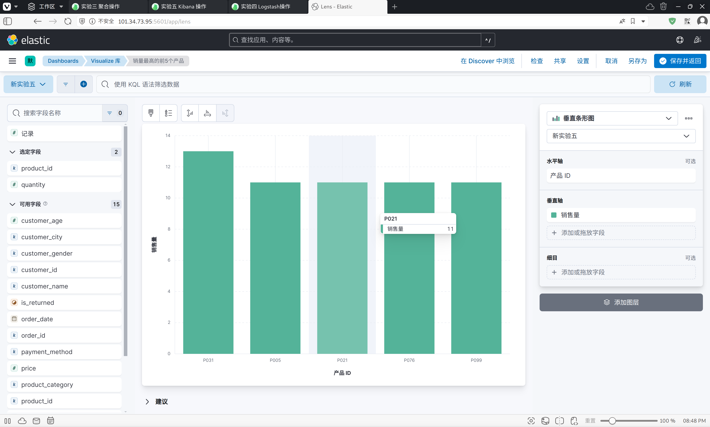

4. 计算男性和女性客户的平均年龄。

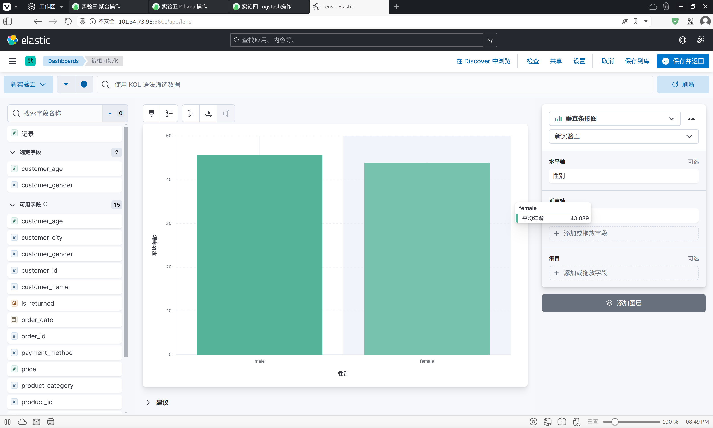

5. 统计每种支付方式的使用次数和总金额。

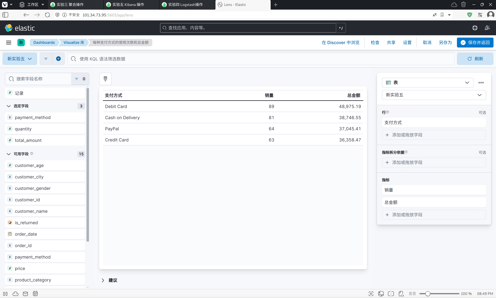

6. 计算每月的总销售额。

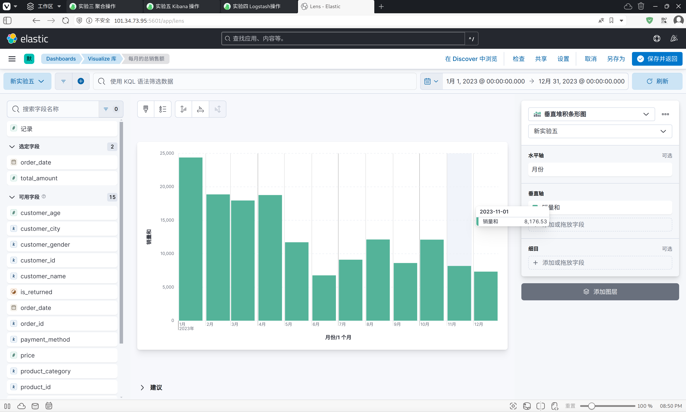

1. 找出平均订单金额最高的前3个客户。

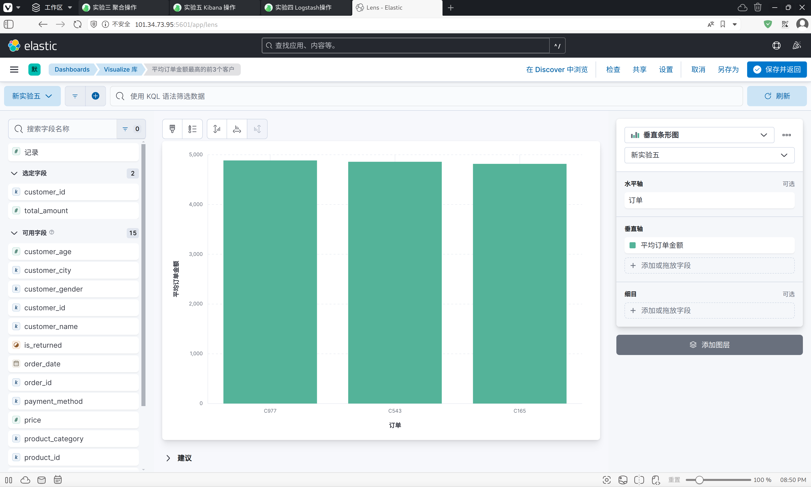

8. 计算每个年龄段（18-30，31-50，51+）的客户数量。

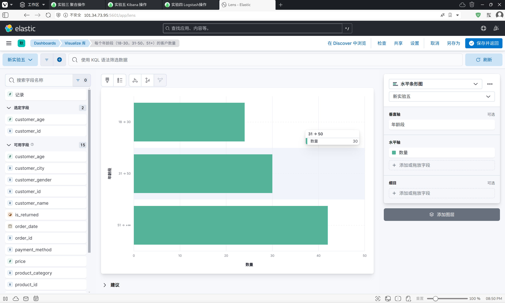

9.  计算每个产品类别的平均单价。

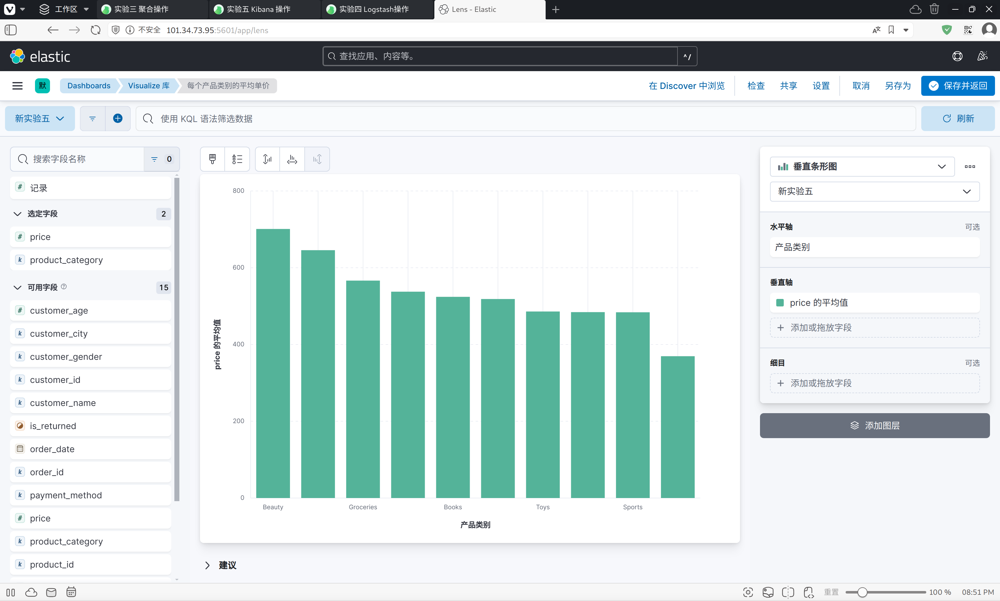

10. 找出订单数量最多的前5个城市。

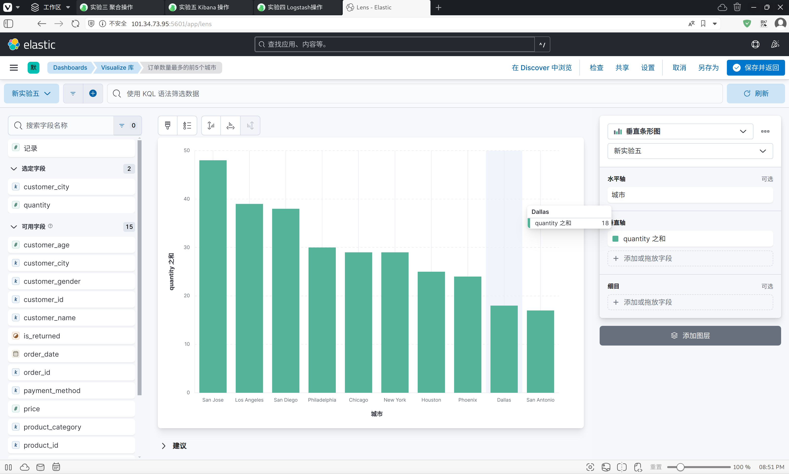

# 三、问题及解决办法