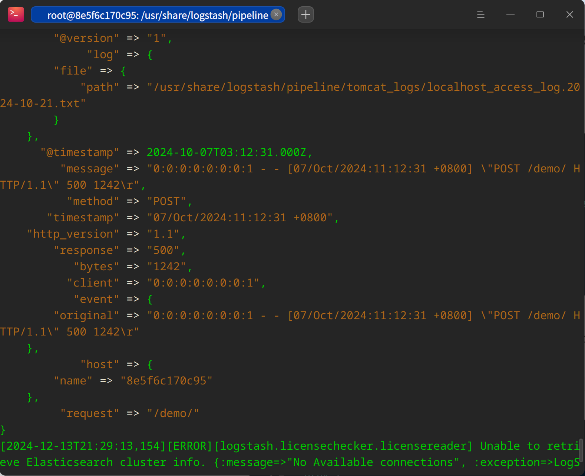
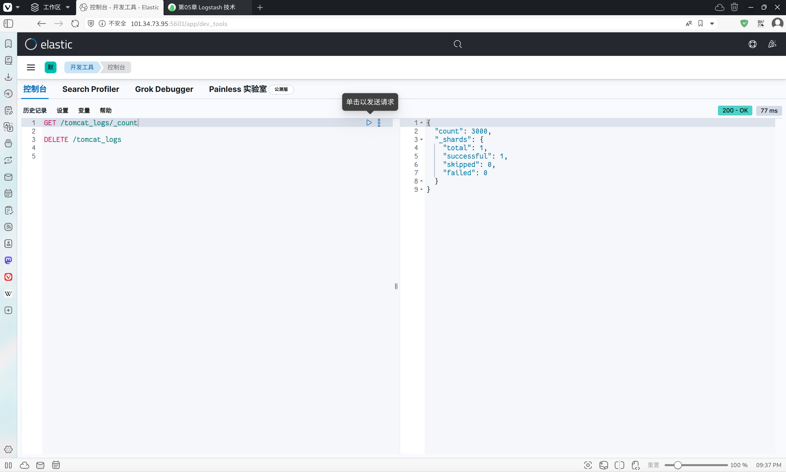

> **学院：省级示范性软件学院**
>
> **题目：** 《 实验四：Logstash 操作》
>
> **姓名：潘文宝**
>
> **学号：** 2200770201
>
> **班级：** 软工2203
>
> **日期：** 2024-11-8
>
> **实验环境：**  Debian12 + Docker + Elasticsearch-8.15.3 + ELK

# 一、实验目的

学习 Logstash 对日志和数据的转换、传输。

# 二、实验内容

## （1）tomcat 日志处理

### 导入数据

在 kibana 中导入数据



这是我的配置：

```conf
input {
    file {
        path => "/usr/share/logstash/pipeline/tomcat_logs/*.txt"
        start_position => "beginning"
        sincedb_path => "/dev/null"
    }
}

output {
    elasticsearch {
        hosts => ["elastic-search:9200"]
        index => "tomcat_logs" 
    }
    stdout {
        codec => rubydebug
    }
}
```

**导入结果：**




### 日志分析

题目：

1. 一个月内，服务器返回的 500 内部服务器错误的比例？

2. 统计 HTTP 状态码出现的次数

3. 请求中的 Host 分布

4. 统计接口访问数量分布情况

5. User-Agent 请求分布情况


# 三、问题及解决办法

## 1. 导入不成功

**出现的原因：** 

`logstash` 命令需要绝对路径，配置文件（包括其内容）都需要修改为绝对路径，再次执行则成功导入！