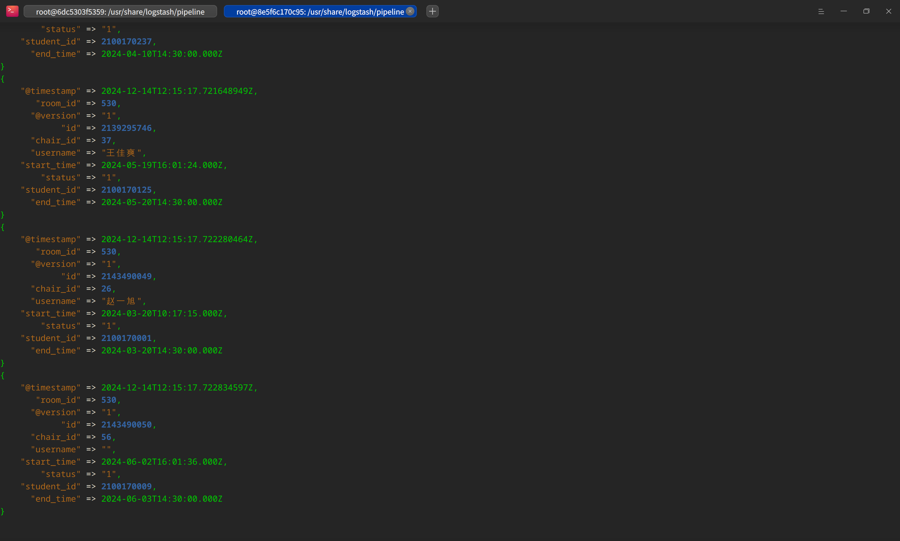
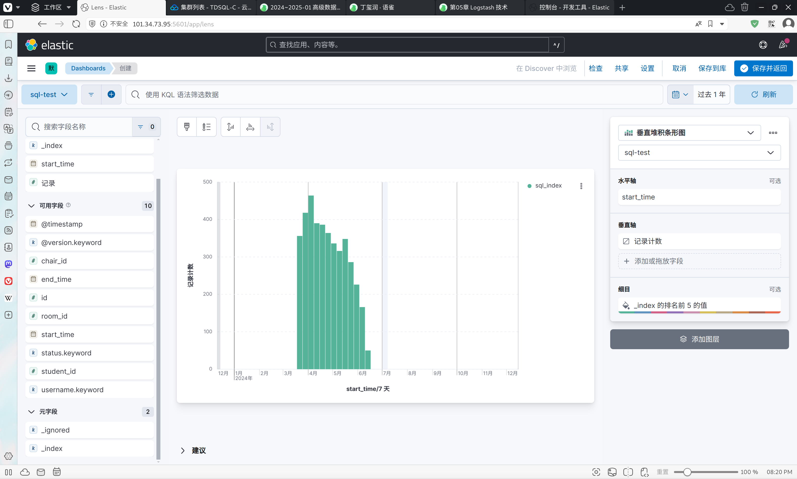

> **学院：省级示范性软件学院**
>
> **题目：** 《 实验四：Logstash 操作》
>
> **姓名：潘文宝**
>
> **学号：** 2200770201
>
> **班级：** 软工2203
>
> **日期：** 2024-11-8
>
> **实验环境：**  Debian12 + Docker + Elasticsearch-8.15.3 + ELK

# 一、实验目的

学习 Logstash 对日志和数据的转换、传输。

# 二、实验内容

## （1）tomcat 日志处理

### 导入数据

在 kibana 中导入数据


这是我的配置：

```conf
input {
    file {
        path => "/usr/share/logstash/pipeline/tomcat_logs/*.txt"
        start_position => "beginning"
        sincedb_path => "/dev/null"
    }
}

filter {
  grok {
    match => { "message" => "%{IPV6:client} - - \[%{HTTPDATE:timestamp}\] \"%{WORD:method} %{URIPATH:request} HTTP/%{NUMBER:http_version}\" %{NUMBER:response} (?:%{NUMBER:bytes}|-)" }
  }
  date {
    match => ["timestamp", "dd/MMM/yyyy:HH:mm:ss Z"]
    target => "@timestamp"
  }
}

output {
    elasticsearch {
        hosts => ["elastic-search:9200"]
        index => "tomcat_logs" 
    }
    stdout {
        codec => rubydebug
    }
}
```

**导入结果：**


### 日志分析

题目：

1. 一个月内，服务器返回的 500 内部服务器错误的比例？

2. 统计 HTTP 状态码出现的次数

```json
GET tomcat_logs/_search
{
  "size": 0,
  "aggs": {
    "status_code_counts": {
      "terms": {
        "field": "response.keyword"
      }
    }
  }
}
```

结果

```json
{
  "took": 42,
  "timed_out": false,
  "_shards": {
    "total": 1,
    "successful": 1,
    "skipped": 0,
    "failed": 0
  },
  "hits": {
    "total": {
      "value": 3000,
      "relation": "eq"
    },
    "max_score": null,
    "hits": []
  },
  "aggregations": {
    "status_code_counts": {
      "doc_count_error_upper_bound": 0,
      "sum_other_doc_count": 0,
      "buckets": [
        {
          "key": "500",
          "doc_count": 781
        },
        {
          "key": "200",
          "doc_count": 749
        },
        {
          "key": "404",
          "doc_count": 738
        },
        {
          "key": "302",
          "doc_count": 732
        }
      ]
    }
  }
}
```

3. 请求中的 Host 分布

```json
GET tomcat_logs/_search
{
  "size": 0,
  "aggs": {
    "host_distribution": {
      "terms": {
        "field": "host.name.keyword"
      }
    }
  }
}
```

结果

```json
{
  "took": 1,
  "timed_out": false,
  "_shards": {
    "total": 1,
    "successful": 1,
    "skipped": 0,
    "failed": 0
  },
  "hits": {
    "total": {
      "value": 3000,
      "relation": "eq"
    },
    "max_score": null,
    "hits": []
  },
  "aggregations": {
    "host_distribution": {
      "doc_count_error_upper_bound": 0,
      "sum_other_doc_count": 0,
      "buckets": [
        {
          "key": "8e5f6c170c95",
          "doc_count": 3000
        }
      ]
    }
  }
}
```

4. 统计接口访问数量分布情况

```json
GET tomcat_logs/_search
{
  "size": 0,
  "aggs": {
    "interface_access_counts": {
      "terms": {
        "field": "request.keyword"
      }
    }
  }
}
```

结果

```json
{
  "took": 5,
  "timed_out": false,
  "_shards": {
    "total": 1,
    "successful": 1,
    "skipped": 0,
    "failed": 0
  },
  "hits": {
    "total": {
      "value": 3000,
      "relation": "eq"
    },
    "max_score": null,
    "hits": []
  },
  "aggregations": {
    "interface_access_counts": {
      "doc_count_error_upper_bound": 0,
      "sum_other_doc_count": 1664,
      "buckets": [
        {
          "key": "/demo1/",
          "doc_count": 153
        },
        {
          "key": "/examples/jsp/images/execute.gif",
          "doc_count": 141
        },
        {
          "key": "/static/js/app.js",
          "doc_count": 139
        },
        {
          "key": "/about",
          "doc_count": 137
        },
        {
          "key": "/static/css/style.css",
          "doc_count": 134
        },
        {
          "key": "/demo/",
          "doc_count": 133
        },
        {
          "key": "/blog/post/2",
          "doc_count": 127
        },
        {
          "key": "/demo/hello",
          "doc_count": 127
        },
        {
          "key": "/examples/jsp/images/return.gif",
          "doc_count": 124
        },
        {
          "key": "/blog/post/3",
          "doc_count": 121
        }
      ]
    }
  }
}
```

5. Http Version 请求分布情况

```json
GET tomcat_logs/_search
{
  "size": 0,
  "aggs": {
    "http_version_distribution": {
      "terms": {
        "field": "http_version.keyword"
      }
    }
  }
}
```

结果

```json
{
  "took": 1,
  "timed_out": false,
  "_shards": {
    "total": 1,
    "successful": 1,
    "skipped": 0,
    "failed": 0
  },
  "hits": {
    "total": {
      "value": 3000,
      "relation": "eq"
    },
    "max_score": null,
    "hits": []
  },
  "aggregations": {
    "http_version_distribution": {
      "doc_count_error_upper_bound": 0,
      "sum_other_doc_count": 0,
      "buckets": [
        {
          "key": "1.1",
          "doc_count": 3000
        }
      ]
    }
  }
}
```

## 数据库

```conf
input {
  jdbc {
    jdbc_driver_library => "/usr/share/logstash/pipeline/mysql-connector-j-8.4.0.jar"
    jdbc_driver_class => "com.mysql.cj.jdbc.Driver"
    jdbc_connection_string => "jdbc:mysql://sh-cynosdbmysql-grp-09nvk3xa.sql.tencentcdb.com:22763/springboot3fy99?characterEncoding=utf-8"
    jdbc_user => "wpanMarket"
    jdbc_password => "market123@wpan"
    statement => "SELECT * FROM reservations"
    schedule => "*/5 * * * *"  
  }
}

output {
  elasticsearch {
    hosts => ["http://elastic-search:9200"]
    index => "sql_index"
    document_id => "_doc"
    action => "index"
  }
  stdout { codec => rubydebug }
}
```



在 kibana 验证



```json
{
  "took": 33,
  "timed_out": false,
  "_shards": {
    "total": 1,
    "successful": 1,
    "skipped": 0,
    "failed": 0
  },
  "hits": {
    "total": {
      "value": 4106,
      "relation": "eq"
    },
    "max_score": 1,
    "hits": [
      {
        "_index": "sql_index",
        "_id": "J-kYxZMBatjkqPFtKeRh",
        "_score": 1,
        "_source": {
          "@timestamp": "2024-12-14T12:15:13.727991457Z",
          "room_id": 530,
          "@version": "1",
          "id": 205721602,
          "chair_id": 31,
          "username": "郑李宜",
          "start_time": "2024-03-30T16:00:29.000Z",
          "status": "1",
          "student_id": 2100940148,
          "end_time": "2024-03-31T14:30:00.000Z"
        }
      },
      {
        "_index": "sql_index",
        "_id": "KOkYxZMBatjkqPFtKeRh",
        "_score": 1,
        "_source": {
          "@timestamp": "2024-12-14T12:15:14.233308487Z",
          "room_id": 530,
          "@version": "1",
          "id": 209915905,
          "chair_id": 29,
          "username": "苏旭晴",
          "start_time": "2024-05-05T16:00:59.000Z",
          "status": "1",
          "student_id": 2100170239,
          "end_time": "2024-05-06T14:30:00.000Z"
        }
      },
      {
        "_index": "sql_index",
        "_id": "KekYxZMBatjkqPFtKeRh",
        "_score": 1,
        "_source": {
          "@timestamp": "2024-12-14T12:15:14.234370149Z",
          "room_id": 530,
          "@version": "1",
          "id": 209915906,
          "chair_id": 11,
          "username": "胡桂琴",
          "start_time": "2024-04-22T16:01:12.000Z",
          "status": "1",
          "student_id": 2100170223,
          "end_time": "2024-04-23T14:30:00.000Z"
        }
      },
      {
        "_index": "sql_index",
        "_id": "KukYxZMBatjkqPFtKeRh",
        "_score": 1,
        "_source": {
          "@timestamp": "2024-12-14T12:15:14.234729810Z",
          "room_id": 530,
          "@version": "1",
          "id": 214110209,
          "chair_id": 13,
          "username": "杨利增",
          "start_time": "2024-06-06T17:13:19.000Z",
          "status": "1",
          "student_id": 2100170148,
          "end_time": "2024-06-07T14:30:00.000Z"
        }
      },
      {
        "_index": "sql_index",
        "_id": "K-kYxZMBatjkqPFtKeRh",
        "_score": 1,
        "_source": {
          "@timestamp": "2024-12-14T12:15:14.235085578Z",
          "room_id": 530,
          "@version": "1",
          "id": 214110210,
          "chair_id": 16,
          "username": "唐红艳",
          "start_time": "2024-03-22T17:04:52.000Z",
          "status": "1",
          "student_id": 2000150446,
          "end_time": "2024-03-23T14:30:00.000Z"
        }
      },
      {
        "_index": "sql_index",
        "_id": "LOkYxZMBatjkqPFtKeRh",
        "_score": 1,
        "_source": {
          "@timestamp": "2024-12-14T12:15:14.235410002Z",
          "room_id": 530,
          "@version": "1",
          "id": 218304513,
          "chair_id": 35,
          "username": "刘杨杨",
          "start_time": "2024-03-26T08:30:41.000Z",
          "status": "1",
          "student_id": 2100170317,
          "end_time": "2024-03-26T14:30:00.000Z"
        }
      },
      {
        "_index": "sql_index",
        "_id": "LekYxZMBatjkqPFtKeRh",
        "_score": 1,
        "_source": {
          "@timestamp": "2024-12-14T12:15:14.235756980Z",
          "room_id": 530,
          "@version": "1",
          "id": 218304514,
          "chair_id": 24,
          "username": "陈柯名",
          "start_time": "2024-03-31T04:59:36.000Z",
          "status": "1",
          "student_id": 2100170207,
          "end_time": "2024-03-31T14:30:00.000Z"
        }
      },
      {
        "_index": "sql_index",
        "_id": "LukYxZMBatjkqPFtKeRh",
        "_score": 1,
        "_source": {
          "@timestamp": "2024-12-14T12:15:14.236115083Z",
          "room_id": 530,
          "@version": "1",
          "id": 222498817,
          "chair_id": 2,
          "username": "吕鑫宇",
          "start_time": "2024-04-25T16:10:55.000Z",
          "status": "1",
          "student_id": 2000220026,
          "end_time": "2024-04-26T14:30:00.000Z"
        }
      },
      {
        "_index": "sql_index",
        "_id": "L-kYxZMBatjkqPFtKeRh",
        "_score": 1,
        "_source": {
          "@timestamp": "2024-12-14T12:15:14.236502510Z",
          "room_id": 530,
          "@version": "1",
          "id": 222498818,
          "chair_id": 15,
          "username": "马丹",
          "start_time": "2024-05-18T10:36:45.000Z",
          "status": "1",
          "student_id": 2100170252,
          "end_time": "2024-05-18T14:30:00.000Z"
        }
      },
      {
        "_index": "sql_index",
        "_id": "MOkYxZMBatjkqPFtKeRh",
        "_score": 1,
        "_source": {
          "@timestamp": "2024-12-14T12:15:14.236868496Z",
          "room_id": 530,
          "@version": "1",
          "id": 226693121,
          "chair_id": 12,
          "username": "习驰",
          "start_time": "2024-06-07T16:40:45.000Z",
          "status": "1",
          "student_id": 2100170271,
          "end_time": "2024-06-08T14:30:00.000Z"
        }
      }
    ]
  }
}
```

# 三、问题及解决办法

## 1. 导入不成功

**出现的原因：** 

`logstash` 命令需要绝对路径，配置文件（包括其内容）都需要修改为绝对路径，再次执行则成功导入！